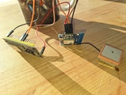

# btMsgSender

Embedded project where ESP32 sends changed speed from GPS (NEO-6M) via bluetooth

## Wiring

Same as in [ESP32 - GPS](https://esp32io.com/tutorials/esp32-gps)

## Code

See [btSpeedSender.ino](btSpeedSender.ino)

## TODO

Android app, that gets messages from bluetooth and with `text-to-speech` tells it out loud.

## Links
1. [ESP32 NODEMCU Module WiFi Development Board with CP2102 (successor model for the ESP8266) Compatible with Arduino](https://www.az-delivery.de/en/products/esp32-developmentboard)
2. [NEO-6M v2](https://www.elektroniikkaosat.com/c-45/p-740878767/GPS-moduuli-NEO-6M.html)
3. [ESP32 - GPS](https://esp32io.com/tutorials/esp32-gps)
4. [ESP32 Bluetooth Classic with Arduino IDE – Getting Started](https://randomnerdtutorials.com/esp32-bluetooth-classic-arduino-ide/)

